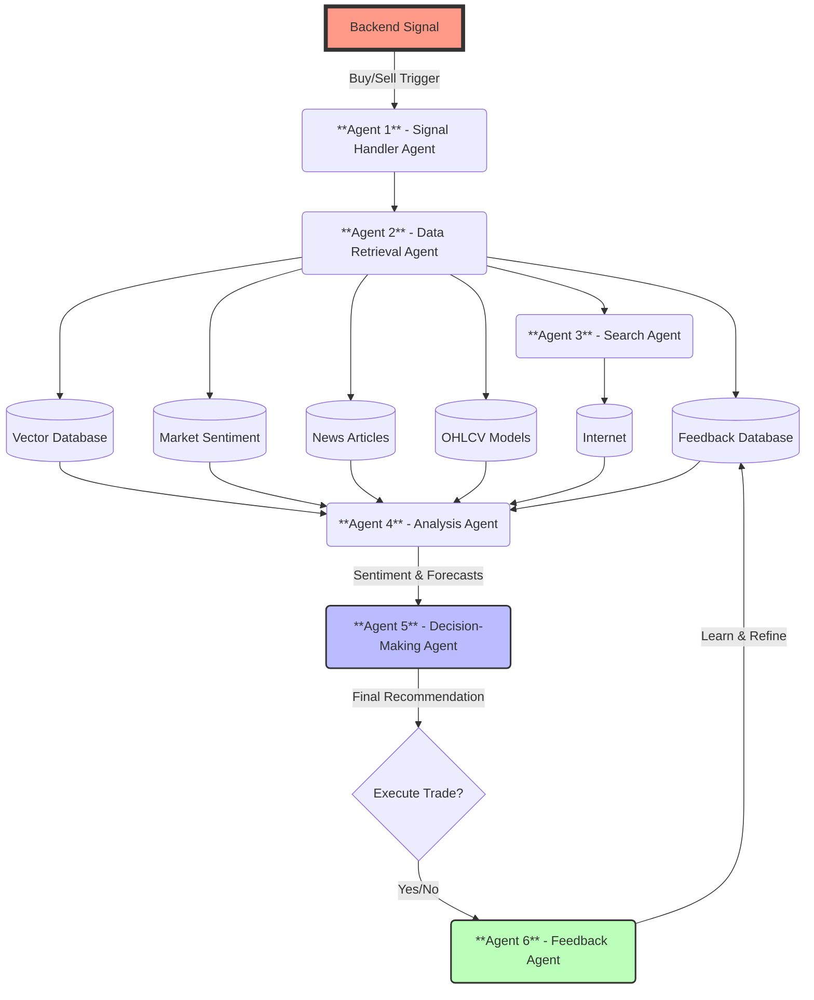

```mermaid
graph TD
    A[Backend Signal] -->|Buy/Sell Trigger| B(**Agent 1** - Signal Handler Agent)
    
    B --> C(**Agent 2** - Data Retrieval Agent)
    C --> N[(OHLCV Models)]
    C --> D[(Vector Database)]
    C --> E[(Market Sentiment)]
    C --> F[(News Articles)]
    C --> G[(OHLCV Models)]
    C --> L(**Agent 3** - Search Agent)
    L --> M[(Internet)]

    D & E & F & G & M & N --> H(**Agent 4** - Analysis Agent)

    H -->|Sentiment & Forecasts| I(**Agent 5** - Decision-Making Agent)
    I -->|Final Recommendation| J{Execute Trade?}

    J -->|Yes/No| K(**Agent 6** - Feedback Agent)
    K -->|Learn & Refine| N
    N[(Feedback Database)] 
    
    style A fill:#f98f,stroke:#333,stroke-width:5px
    style I fill:#bbf,stroke:#333,stroke-width:2px
    style K fill:#bfb,stroke:#333,stroke-width:2px
```
