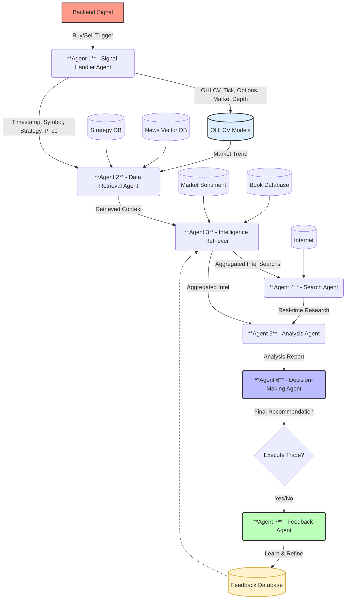

```mermaid
graph TD
    A[Backend Signal] -->|Buy/Sell Trigger| B(**Agent 1** - Signal Handler Agent)
    
    %% Updated Data Flow from Agent 1
    B -->|OHLCV, Tick, Options, Market Depth| G[(OHLCV Models)]
    
    %% Specific Context Transfer
    B -->|Timestamp, Symbol, Strategy, Price| C(**Agent 2** - Data Retrieval Agent)
    
    %% Agent 2 Sources
    DB1[(Strategy DB)] --> C
    DB2[(News Vector DB)] --> C
    G -->|Market Trend| C

    %% Agent 3 Central Intelligence
    C -->|Retrieved Context| D(**Agent 3** - Intelligence Retriever)
    E[(Market Sentiment)] --> D
    F[(Book Database)] --> D

    %% Agent 4 & Internet
    D -->|Aggregated Intel Searchs| L(**Agent 4** - Search Agent)
    M[(Internet)] --> L
    L -->|Real-time Research| H(**Agent 5** - Analysis Agent)
    D -->|Aggregated Intel| H

    %% Final Decision Path
    H -->|Analysis Report| I(**Agent 6** - Decision-Making Agent)
    I -->|Final Recommendation| J{Execute Trade?}

    %% Feedback Loop
    J -->|Yes/No| K(**Agent 7** - Feedback Agent)
    K -->|Learn & Refine| FB[(Feedback Database)]
    FB -.-> D

    %% Styling
    style A fill:#f98,stroke:#333,stroke-width:2px
    style I fill:#bbf,stroke:#333,stroke-width:2px
    style K fill:#bfb,stroke:#333,stroke-width:2px
    style FB fill:#fff2cc,stroke:#d6b656,stroke-width:2px
    style G fill:#def,stroke:#333,stroke-width:2px
```
