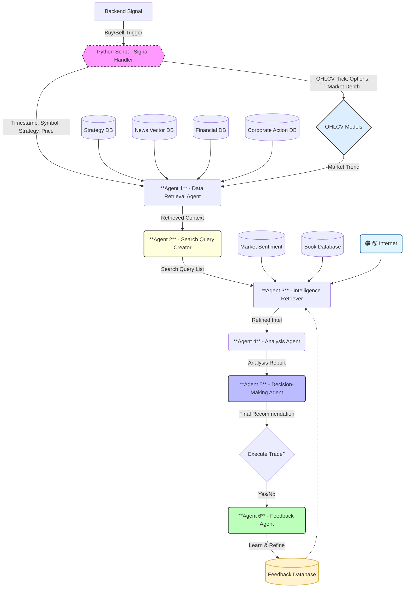

```mermaid
graph TD
    A[Backend Signal] -->|Buy/Sell Trigger| B{{Python Script - Signal Handler}}
    
    %% Script Feeds Model
    B -->|OHLCV, Tick, Options, Market Depth| G{OHLCV Models}
    
    %% Specific Context Transfer
    B -->|Timestamp, Symbol, Strategy, Price| C(**Agent 1** - Data Retrieval Agent)
    
    %% Agent 1 Expanded Sources
    DB1[(Strategy DB)] --> C
    DB2[(News Vector DB)] --> C
    DB3[(Financial DB)] --> C
    DB4[(Corporate Action DB)] --> C
    G -->|Market Trend| C

    %% Agent 2 - Search Query Creator
    C -->|Retrieved Context| D(**Agent 2** - Search Query Creator)
    
    %% Query Distribution
    D -->|Search Query List| E(**Agent 3** - Intelligence Retriever)


    %% Agent 3 Intelligence Gathering
    M[(Market Sentiment)] --> E
    F[(Book Database)] --> E
    E -->|Refined Intel| H(**Agent 4** - Analysis Agent)

    %% Agent 4 Internet Search with Icon
    N(fa:fa-globe 🌎 Internet) --> E

    %% Final Decision Path
    H -->|Analysis Report| I(**Agent 5** - Decision-Making Agent)
    I -->|Final Recommendation| J{Execute Trade?}

    %% Feedback Loop
    J -->|Yes/No| K(**Agent 6** - Feedback Agent)
    K -->|Learn & Refine| FB[(Feedback Database)]
    FB -.-> E

    %% Styling
    style B fill:#f9f,stroke:#333,stroke-width:2px,stroke-dasharray: 5 5
    style I fill:#bbf,stroke:#333,stroke-width:2px
    style K fill:#bfb,stroke:#333,stroke-width:2px
    style FB fill:#fff2cc,stroke:#d6b656,stroke-width:2px
    style G fill:#def,stroke:#333,stroke-width:2px
    style D fill:#ffd,stroke:#333,stroke-width:2px
    style N fill:#e1f5fe,stroke:#01579b,stroke-width:2px
```
